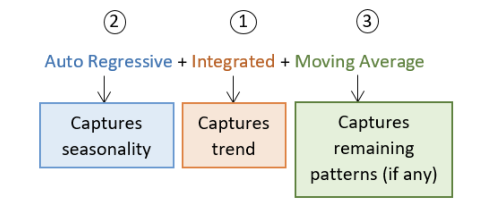

# Stock Tracker
This is a good entry project into financial engineering as it provides an opportunity to cover important
and foundational financial knowledge.

Financial concepts covered:
- Understanding of financial instruments(stocks, etfs, mutual funds, crypto, etc.).
- Basic knowledge of stock pricing and volume data.
- Time series analysis.

Libraries:
- pandas
- yfinance
- statsmodels
- matplotlib
- pmdarima

## Project Objectives
#### Data exploration and visualization
##### Objectives
- Understanding the charcteristics of stock data and identification of patterns.
- Creating visualizations (candlestick charts, line charts).
- Exploring summary statistics and distribution and trends.

##### Notes
- Understanding the different financial instruments - Stocks(Equities), Fixed-Income(Bonds), Derivatives(Options, Futures), Forex, Commodities, REITs, Mutual Funds, Crypto.
- Stock trading is the buying and selling of stocks.
- Short selling is the borrowing of shares and immediately selling them in the hope of buying for cheaper and making a margin.
- Dividends are the distribution of a companies profits. E.g cash dividends, stock dividends, dividend yield.
- Stock split, is an action that increase number of shares whilst decreasing cost per share, without affecting overall market of the company.
- Adjusted prices refer to prices that have been modified due to corporate actions (dividends and stock splits).
- A moving average is a statistical calculation that smooths out fluctuations and helps to discover trends over time.

#### Time Series Analysis
##### Objectives
- Analyze and model the behavior of financial instruments over time.
- Explore concepts like autorelation, volatility and seasonality
##### Notes
- Time series is the study of data points collected/recorded over time.  
- Time series are either stationary or non-stationary.  
- Stationary series have constant statistical properties over time, thus easier to model and analyze.  
- The Dickey-Fuller Test for stationarity, helps identify trends and seasonality in a time series.  
- It is enabled by the adfuller method from `statsmodel` which returns the following: 
    - ADF statistic which is the extent to which a unit root is present in a time series (is non-stationary).
    - p-value which indicates the probability of observing the given ADF statistic if the null hypothesis is true and critical values which are threshold to compare and give significance to the ADF statistic.
    - Autocorrelation is a measure of how well the current value of the time series related to it’s past values. The measure of correlation between a time series and it’s lagged values. If autocorrelation is high at a specific lag (time units between current value and past values), it suggests that values at that lag have strong linear relationship with current values
        - Partial autocorrelation is a measure of correlation between a time series and a lagged value controlling for the effect of intervening values. It identifies direct relationship between a current value and a specific lag, excluding the influence of intermediate lags.
- Forecasting models are statistical modes that use historical data to make predictions about future values. It captures trends in data to project future values.
- ARIMA Model is a forecasting model that helps to capture trends and autocorrelation in Time Series data, it combines three key components:
    - Autoregressive component involves predicting future value based on past values. Assumes that a future value is a linear combination of a past value.
    - Integrated component involves differencing a time series to make it stationary. Why? Differencing removes seasonality/trends in the data.
    - Moving average component involves predicting a future value based on past forecast errors.
######  ARIMA Modelling Process:
 
- Identify stationarity
- Identify model parameters (autoregression component, order of differencing and order of moving average components.
- Use historical data to estimate model parameters (fit ARIMA model)
- Make forecasts
